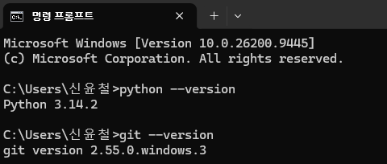
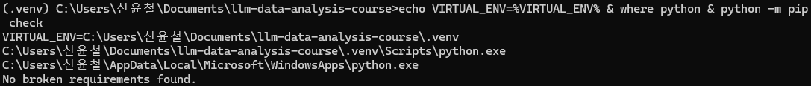
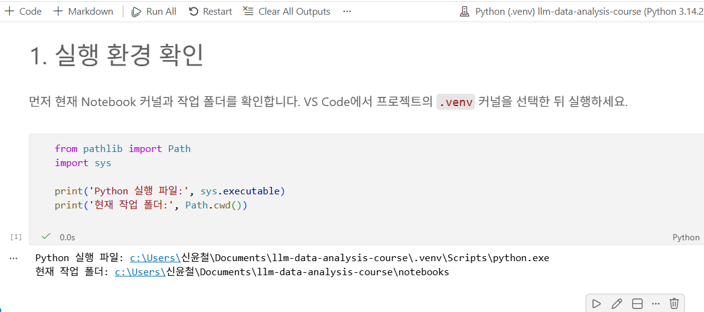
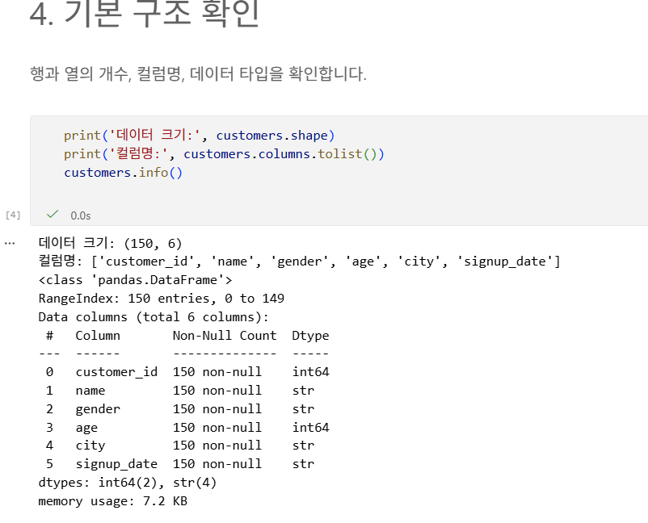
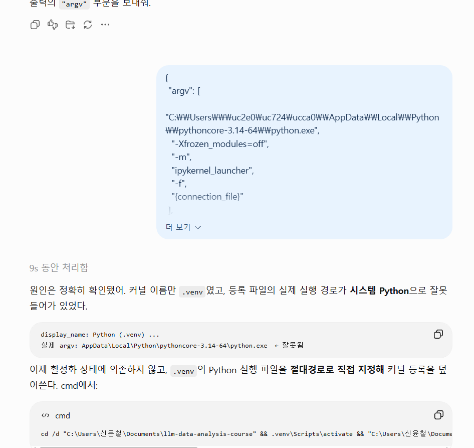
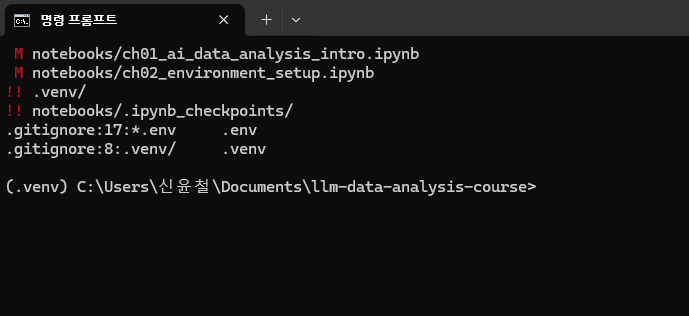

# Chapter 02 제출 답안. VS Code에서 시작하는 데이터 분석 환경

> 최종 파일은 개인 GitHub 저장소의 `chapter02/chapter02.md`로 저장하는 것을 권장합니다.

## 0. 제출 정보

- 이름: 신윤철
- GitHub ID: ycshin2002
- 개인 저장소: `llm-data-analysis-study`
- 작성일: 2026-09-11
- 운영체제:Windows 10 64-bit

### 최종 제출 URL

```text
https://github.com/ycshin2002/llm-data-analysis-study/blob/main/chapter02/chapter02.md
```

---

## 1. Python과 Git 환경 확인

### 실행 내용

```text
python --version 또는 py --version
git --version
```

### 실행 결과

```text
여기에 실제 결과를 작성하세요.
```

### Evidence



### 결과 관찰

명령 프롬프트에서 Python 3.14.2와 Git 2.55.0이 모두 정상 실행되어, 두 도구가 설치되어 있고 PATH에도 등록된 것을 확인했다.

### 나의 해석과 판단

기본 실행 환경은 수업 실습을 시작하기에 충분하지만, Python 3.14는 비교적 최신 버전이므로 이후 패키지 설치 시 호환성을 확인해야 한다.

### 업무·분석적 의미

프로젝트 시작 전에 도구의 설치·버전·실행 경로를 확인하면 환경 문제를 데이터나 코드 오류로 잘못 판단하는 일을 줄일 수 있다.

### 한계와 추가 확인 사항

이 단계에서는 시스템 Python만 확인했으므로, 다음 단계에서 프로젝트별 .venv와 필요한 라이브러리가 정상 구성되는지는 별도로 검증해야 한다.

---

## 2. 저장소와 `.venv` 준비

### 수행 내용

- [x] 공식 Public 저장소 clone
- [x] 프로젝트 루트 확인
- [x] `.venv` 생성
- [x] `.venv` 활성화
- [x] `requirements.txt` 설치

### 핵심 실행 결과

```text
현재 프로젝트 경로: C:\Users\신윤철\Documents\llm-data-analysis-course
터미널 Python 실행 파일: C:\Users\신윤철\Documents\llm-data-analysis-course\.venv\Scripts\python.exe
가상환경 활성화 여부: 활성화됨. 명령 프롬프트에 (.venv)가 표시되었고, python 명령이 프로젝트의 .venv 경로를 우선 사용했다.
패키지 설치 결과: python -m pip install -r requirements.txt 실행이 Successfully installed 메시지와 함께 정상 완료되었다.
``` 

### Evidence



### 결과 관찰

현재 `python`이 어떤 실행 파일을 가리키는지 작성하세요.

프로젝트 루트에 공식 GitHub 저장소 연결, .venv, requirements.txt가 존재하며 활성화 후 Python 실행 경로가 .venv\Scripts\python.exe를 가리켰다.
### 나의 해석과 판단

시스템 Python과 프로젝트 `.venv`를 분리하는 것이 왜 필요한지 자신의 말로 작성하세요.

가상환경 활성화는 현재 터미널의 PATH 우선순위를 바꿔 프로젝트 전용 Python과 패키지를 사용하게 하므로, 시스템 환경과 분리된 실습 환경이 구성되었다고 판단했다.
### 업무·분석적 의미

다른 사람이 같은 프로젝트를 재실행할 때 가상환경이 주는 이점을 작성하세요.
동일한 requirements.txt를 사용하면 다른 사람도 프로젝트별 의존성을 비슷하게 설치해 분석 환경을 재현할 수 있다.
### 한계와 추가 확인 사항

회사/기관 PC 정책, Python 버전 차이 등 현재 환경의 제약을 작성하세요.
현재 .venv는 Python 3.14.2 기반이므로, 이후 일부 라이브러리 또는 수업 코드가 해당 최신 버전과 호환되는지는 노트북 실행 단계에서 추가 확인해야 한다.
---

## 3. VS Code 인터프리터와 Jupyter 커널 연결

### 확인 결과

```text
VS Code Python 인터프리터:C:\Users\신윤철\Documents\llm-data-analysis-course\.venv\Scripts\python.exe
Notebook sys.executable:C:\Users\신윤철\Documents\llm-data-analysis-course\.venv\Scripts\python.exe
Notebook Path.cwd():C:\Users\신윤철\Documents\llm-data-analysis-course\notebooks
```

### Evidence



### 결과 관찰

터미널 Python과 Notebook Python이 같은 `.venv`인지 작성하세요.
VS Code Notebook의 Python 실행 파일이 프로젝트의 .venv\Scripts\python.exe이며, 작업 폴더는 notebooks로 확인되었다.

### 나의 해석과 판단

둘이 다를 경우 어떤 문제가 발생할 수 있는지 작성하세요.
Notebook도 터미널과 동일한 .venv를 사용하도록 연결되어 설치한 라이브러리를 일관되게 사용할 수 있다.만약 다르면 다른 환경에서 진행되게 되어 충돌이 발생하거나 라이브러리가 없어 실행시 오류가 발생할 수 있다.

### 업무·분석적 의미

`ModuleNotFoundError` 같은 환경 오류를 줄이는 데 어떤 도움이 되는지 작성하세요.
터미널과 Notebook의 실행 환경을 일치시키면 환경 차이로 인한 ModuleNotFoundError와 패키지 버전 불일치 문제를 줄일 수 있다.

### 한계와 추가 확인 사항

커널 이름만 보고 판단하면 안 되는 이유 등 추가 확인 사항을 작성하세요.
커널 표시 이름이나 Python 버전만으로는 환경 일치를 보장할 수 없으므로 sys.executable의 실제 경로를 확인해야 한다. cmd의 args로 정확히 설정되었는지 확인하여야 한다.
---

## 4. 샘플 데이터와 Notebook 실행 검증

### 확인 결과

```text
DATA_DIR 존재 여부: True
customers.csv 존재 여부: True
customers.shape: (150, 6)
주요 컬럼: ['customer_id', 'name', 'gender', 'age', 'city', 'signup_date']
```

### Evidence



### 결과 관찰

`customers.head()`, shape, 컬럼 결과에서 직접 확인한 사실을 작성하세요.
customers.csv가 정상적으로 로드되었고, 데이터는 150개 행과 6개 열로 구성되며 모든 컬럼에 결측값이 없음을 확인했다.
### 나의 해석과 판단

이 단계까지 성공했다면 어떤 구성 요소가 정상 연결되었다고 판단할 수 있는지 작성하세요.
Notebook 커널, 프로젝트 경로, 데이터 폴더, pandas 라이브러리가 모두 정상적으로 연결되어 샘플 데이터를 분석 가능한 상태라고 판단했다.
### 업무·분석적 의미

분석 전에 최소 스모크 테스트를 하는 이유를 작성하세요.
분석 전 데이터 파일을 실제로 불러오는 스모크 테스트를 수행하면 환경·경로·패키지 문제를 본격적인 분석 전에 발견할 수 있다. 항상 python 기반 실험을 수행할 때에, 스모크 테스트는 필수이다. 만약 AI 개발을 한다고 친다면 1epoch당 최소 수시간이 필요한데, 이러면 끝도 없는 굴레에 빠져들며, 그 이전에 코딩 아키텍처/다이나믹스 관련 smoke test, 게다가 연구라면 연구의 정당화 과정에서의 smoke test문제가 연달아 터지고 섞여 문제가 아주 커질 수 있다.
### 한계와 추가 확인 사항

현재는 환경 연결만 확인했으며 데이터 품질은 아직 검증하지 않았다는 점을 작성하세요.
현재 확인한 것은 파일 로드와 기본 구조뿐이므로, 값의 정확성·중복·이상치·분석 목적에 대한 적합성은 이후 데이터 품질 검증에서 별도로 확인해야 한다. 빅데이터 분석의 본론에 아직 들어가지 않았으므로 이는 자연스러운 현상이다.
---

## 5. 오류 해결 기록

실습 중 오류가 있었다면 작성합니다. 오류가 없었다면 `해당 없음`이라고 적습니다.
오류는 없으나 kernel의 위치가 jupyter kernel이어서 찾기 힘들었던점, 그리고 가장 중요하게는 그렇게 설정된 커널의 명칭이나 경로는 정확했으나 핵심 python.exe 실행 경로가 일반 파이썬 경로로 확인되어 cmd명령어로 args를 직접 확인해야 하였다.
### 오류 메시지

```text
민감정보를 제거한 실제 오류
오류 메시지는 없음, 출력을 의도대로 확인하는 과정에서 의미 단위 목적 미달성만 존재
```

### 원인 후보

1. 설치 과정에서 경로 자동탐색에서 꼬였다.
2. 기존에 정확히 이해하지 못할 때 설치한 하나의 jupyter kenel venv가 눈속임을 하였다.
3. PATH에서 인식을 제대로 하지 못하였다.

### 내가 확인한 순서

1. LLM을 이용하여 jupyter kenel에 위치하엿음을 확인
2. 올바르게 설정하고 실행하였으나 여전히 문제 발생
3. cmd명령어로 확인 결과 이름만 llm-analysis였지, 실제 python 연결 경로가 잘못되었음을 확인

### 해결 방법

```text
실제로 적용한 해결 방법
LLM을 이용하여 이 경로를 바꾸는 cmd명령어를 제공받음, 실행하여 의도대로 올바르게 바뀐 점까지 LLM을 이용하여 확인함
```

### Evidence



### 나의 해석과 판단

왜 해당 원인이 가장 가능성이 높다고 판단했는지 작성하세요.
이런 경로나 특유의 내부를 뜯어야 알 수 있는 문제가 이상하게 필자 본인에게 자주 발생하였고, 빅데이터 통계적으로 이런 경우에 사소한 설정같은것에서 시스템 오류가 발생하였음을 주로 확인하였다.

### 한계와 추가 확인 사항

보안 정책 변경, 무분별한 삭제처럼 시도하지 않은 조치와 이유를 작성하세요.

--- LLM의보조를 받아 사소한 문제일것으로 예상되기도 했고, 이와는 별도로 사전에 venv설치 이후 제대로 설치된것을 cmd 명령어를 통해 venv list를 보고 확인하였기 때문에 문제 없었다.

## 6. Secret 보호 확인

- [x] `.env`는 Git 추적 대상이 아닙니다.
- [x] 실제 API Key를 코드에 작성하지 않았습니다.
- [x] 캡처 화면에 Token/비밀번호가 없습니다.
- [x] `.venv`를 Git에 올리지 않습니다.

### Evidence

필요한 경우 `git status`, `.gitignore` 확인 화면을 첨부합니다.



### 나의 해석과 판단

환경 파일과 비밀정보를 분리해야 하는 이유를 작성하세요.
당연하게도 비밀 정보를 분리해야 하며, 이가 github등에 올라가는 경우 자신의 비밀번호 등으로 해킹을 시도하거나, 자신에게 할당된 임의의 자원을 회수하고 사용할 수 있기 때문이다. venv의 경우 크고 재생성 가능하므로 뼈대인 txt만 보내며, env에 있는 민감한 api key, db 비밀번호, token은 !!(igonre)해야 한다.
---

## 7. Chapter 02 최종 회고

### 가장 중요했다고 생각한 환경 설정 1가지

```text
프로젝트 전용 .venv를 만들고 VS Code Notebook 커널까지 동일한 환경으로 연결한 설정이다.
```

### 그 이유

```text
터미널과 Notebook이 같은 Python 실행 파일과 라이브러리 환경을 사용해야 패키지 누락이나 버전 차이로 인한 실행 오류를 줄일 수 있기 때문이다.항상 setting이 기저의 아키텍처나 복잡한 코드,실행 파이프라인과 엮여 어려움을 겪는 경우가 많아 시작이 반이라고 생각한다.
```

### 다음 Chapter에서 재사용할 환경 체크 3가지

1.터미널의 python과 Notebook의 sys.executable이 모두 프로젝트 .venv 경로를 가리키는지 확인한다.
2.requirements.txt를 프로젝트 .venv에 설치하고, 필요한 라이브러리를 Notebook에서 실제로 import해 본다.
3.git status와 .gitignore를 확인해 .env, API Key, Token, .venv가 Git 추적 대상이 아닌지 점검한다.
### 현재 환경의 한계 또는 주의점

```text
.venv는 라이브러리 환경을 분리하지만 Python 버전, 운영체제, 난수 시드, 외부 서비스 설정까지 자동으로 동일하게 만들지는 않으므로 별도 기록과 관리가 필요하다.
```

---

## 최종 제출 체크

- [x] 핵심 Evidence 4~7장을 첨부했습니다.
- [x] 단순 캡처가 아니라 관찰과 판단을 작성했습니다.
- [x] Secret/개인정보가 없습니다.
- [x] GitHub에서 이미지가 정상 표시됩니다.
- [x] 개인 저장소에 `chapter02/chapter02.md`를 업로드했습니다.
- [x] 저장소 URL이 아니라 최종 파일 URL을 제출합니다.