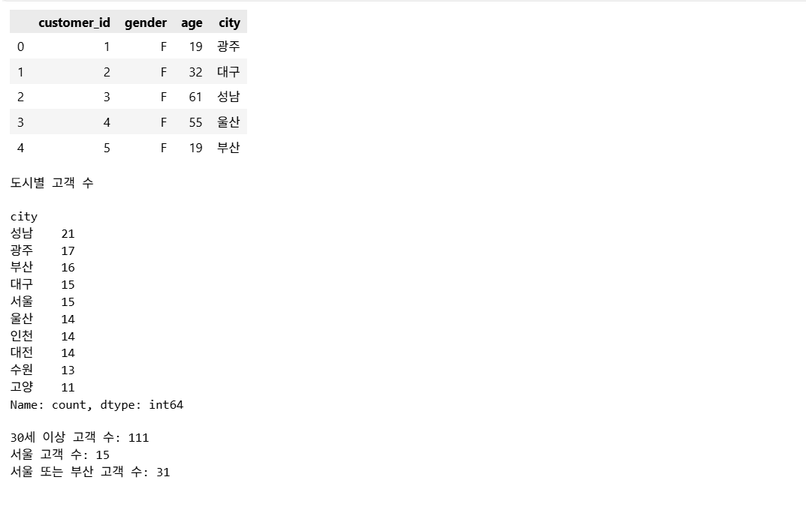
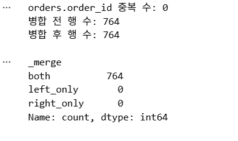
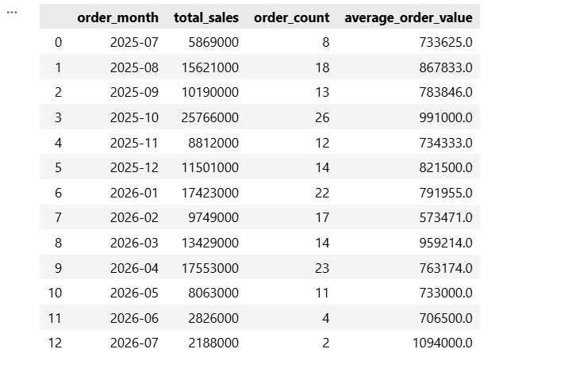
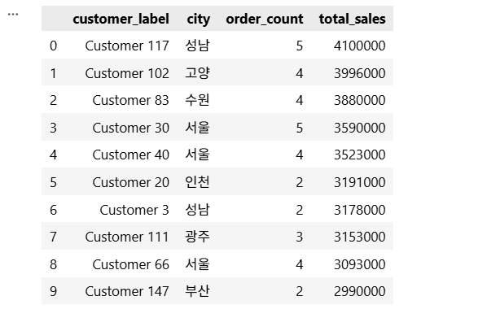
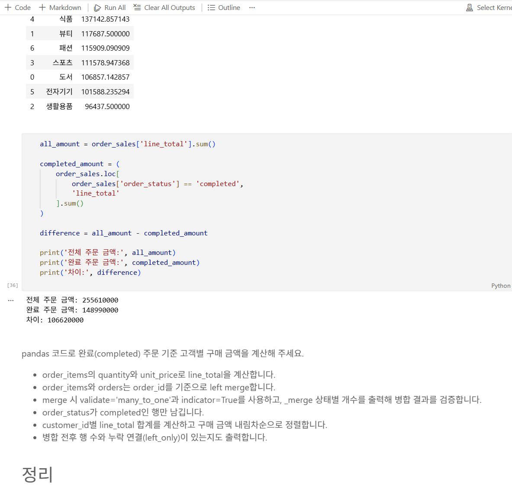

# Chapter 04 제출 답안 양식. pandas로 데이터에 질문하기

> 주 제출물은 실행 완료 Notebook `chapter04/chapter04.ipynb`입니다. 이 양식의 항목을 Notebook의 Markdown 셀로 추가해 작성합니다.

## 0. 제출 정보
- 이름: 신윤철
- GitHub ID: ycshin2002
- 작성일: 2026-10-06
- 최종 제출 URL: https://github.com/ycshin2002/llm-data-analysis-study/blob/main/chapter04/chapter04.ipynb

## 1. 질문과 필요한 데이터 선택
### 내가 확인하려는 질문
완료된 주문만을 기준으로 어떤 카테고리·상품·기간·고객에서 매출이 발생했는지 확인한다.

### 사용한 파일/컬럼
- `order_items.csv`: `order_id`, `product_id`, `quantity`, `unit_price`로 주문상품별 금액을 계산했다.
- `orders.csv`: `order_id`, `customer_id`, `order_date`, `order_status`로 주문 상태·날짜·고객을 연결했다.
- `products.csv`: `product_id`, `product_name`, `category`로 상품과 카테고리를 연결했다.
- `customers.csv`: `customer_id`, `city`로 고객별 결과에 지역 정보를 추가했다.

### 결과 관찰
원본 데이터는 고객 150명, 상품 100개, 주문 300건, 주문상세 764행이다. 완료 주문에 해당하는 주문상세는 474행이며 완료 주문 금액은 148,990,000원이다.

### 나의 해석과 판단
주문 금액은 주문상세의 수량과 단가에서 계산해야 하므로 `order_items`를 분석의 출발점으로 선택했다. 주문 상태는 `orders`, 카테고리는 `products`에 있으므로 각 표를 key로 연결한 뒤 완료 주문만 집계했다.

### 업무·분석적 의미
완료 주문 범위를 명시하면 취소·환불 주문을 매출로 과대계상하는 문제를 피할 수 있다. 카테고리·상품·월·고객별 집계는 재고, 프로모션, 고객 관리의 기초 근거가 된다.

### 한계와 추가 확인 사항
`completed`가 실제 매출 인식 기준과 같은지, 환불·부분취소가 이후 별도로 반영되는지 확인해야 한다. 데이터가 약 1년 단위의 표본이므로 계절성이나 장기 추세를 단정할 수 없다.

## 2. 필터링·정렬·파생 컬럼
- 적용한 필터 조건: `order_status == 'completed'`; 실습에서는 `age >= 40` 고객도 별도로 추출했다.
- 정렬 기준: 매출·가격·나이를 내림차순으로 정렬했다.
- 만든 파생 컬럼: `line_total`, `order_month`, `sales_ratio`, `average_order_value`, `customer_label`
- `line_total` 계산식: `quantity * unit_price`

### 결과 관찰
전체 주문상세 금액은 255,610,000원이고 완료 주문 금액은 148,990,000원이다. 완료 주문으로 범위를 제한했을 때 제외되는 금액은 106,620,000원이며, 40세 이상 고객은 78명이다.

### 나의 해석과 판단
완료 상태만 남기면 취소·환불 상태의 주문상세가 제외되어 매출의 의미가 더 명확해진다. 반면 전체 주문을 집계하면 주문 시도 규모와 취소·환불 규모를 함께 파악할 수 있다.

### 업무·분석적 의미
`line_total`은 상품 행 단위의 금액이므로 이후 어떤 기준으로 묶더라도 동일한 매출 기준을 사용할 수 있다. 상태 필터는 매출 보고의 정의를 일관되게 유지한다.

### 한계와 추가 확인 사항
단가가 할인·쿠폰·배송비·세금 등을 반영한 최종 결제 단가인지 확인해야 한다. 연령 40세 이상 필터는 실습용 분류이며 고객 가치가 연령만으로 설명된다고 해석해서는 안 된다.

## 3. merge 검증
- 병합한 데이터: `order_items` + `orders`, `completed_order_sales` + `products`, `customer_sales` + `customers`
- 사용한 key: 각각 `order_id`, `product_id`, `customer_id`
- `validate` 결과: 주문상세→주문은 `many_to_one`, 주문상세→상품은 `many_to_one`, 고객별 요약→고객은 `one_to_one`으로 검증했다.
- `indicator` 결과: 주문상세+주문은 `both` 764건·`left_only` 0건, 완료 주문상세+상품은 `both` 474건·`left_only` 0건이다.
- 병합 전/후 행 수: 1차 병합은 764행→764행, 2차 병합은 474행→474행이다.

### 결과 관찰
두 단계의 `left merge`에서 모든 행이 `both`였고, 병합 전후 행 수가 변하지 않았다. 주문과 상품 key에 누락 연결이나 오른쪽 표의 중복 key로 인한 행 증가가 없었다.

### 나의 해석과 판단
기준 표의 모든 행이 보존되고 병합 상태가 모두 정상 연결이므로 이번 병합은 안전하다고 판단했다. `validate`를 지정했기 때문에 오른쪽 표의 key 중복으로 주문상세 행이 복제되는 경우도 방지했다.

### 업무·분석적 의미
잘못된 merge는 한 주문상세를 여러 번 복제해 매출을 부풀리거나, 연결 실패 행을 누락시켜 매출을 과소계상할 수 있다. 따라서 분석 결과를 해석하기 전에 행 수와 `_merge` 상태를 확인해야 한다.

### 한계와 추가 확인 사항
현재 표본에서는 `left_only`가 없지만, 신규 상품·삭제된 상품·손상된 주문 ID가 들어오는 실제 운영 데이터에서는 지속적으로 점검해야 한다.

## 4. completed 주문 범위와 집계
- 분석 범위 정의: `order_status == 'completed'`인 주문상세 474행, 완료 주문 금액 148,990,000원
- 카테고리별 결과: 스포츠 31,743,000원(21.31%)으로 가장 높고, 패션 10,587,000원(7.11%)으로 가장 낮다.
- 상품별 결과: `스포츠 상품 041`이 5,705,000원으로 가장 높다.
- 월별 결과: 2025-10이 25,766,000원으로 가장 높다. 2026-07은 2,188,000원이지만 월 전체 데이터인지 추가 확인이 필요하다.
- 고객별 결과: Customer 117이 4,100,000원, 5건으로 가장 높은 완료 주문 구매 금액을 기록했다.

### 결과 관찰
스포츠 카테고리는 완료 주문 매출의 21.31%를 차지한다. 상위 상품인 `스포츠 상품 041`의 매출은 5,705,000원이며, 상위 고객인 Customer 117의 구매 금액은 4,100,000원이다.

### 나의 해석과 판단
카테고리 수준에서는 스포츠가 가장 큰 매출 기여를 보이므로 우선적인 재고·프로모션 점검 대상이다. 그러나 단일 상품 또는 단일 고객의 높은 금액만으로 지속적인 수요라고 판단하기보다 주문 기간과 반복 구매 여부를 함께 확인해야 한다.

### 업무·분석적 의미
카테고리별 결과는 재고와 캠페인 우선순위를, 상품별 결과는 상품 운영을, 월별 결과는 시기별 계획을, 고객별 결과는 고객 세분화의 출발점을 제공한다.

### 한계와 추가 확인 사항
`total_sales`는 수량×단가로 계산한 완료 주문상세 금액이다. 할인, 세금, 배송비, 부분취소, 환불 시점, 회계상 매출 인식 규칙을 반영했는지 확인하지 않았으므로 회계상 순매출과 같다고 단정할 수 없다.

## 5. 총합 일치 검증
- 원본 completed `line_total` 합계: 148,990,000원
- 카테고리 합계: 148,990,000원
- 월별 합계: 148,990,000원
- 고객별 합계: 148,990,000원
- 차이 여부: 없음(모든 합계의 차이는 0원)

### 나의 해석과 판단
서로 다른 기준으로 집계한 총합이 모두 원본 완료 주문상세 금액과 일치하므로, 현재 필터와 집계 과정에서 행 누락·중복 집계가 없었음을 확인했다. 불일치가 발생하면 분석 범위(`completed` 조건), 병합 후 행 수와 `_merge` 상태, groupby key의 결측치, 중복 행을 순서대로 확인한다.

## 6. LLM pandas 코드 검증
- LLM Prompt 요약: 완료 주문 기준 고객별 구매 금액을 계산하되, `order_id` 병합에 `validate='many_to_one'`, `indicator=True`를 사용하고 행 수·누락 연결을 출력하도록 요청했다.
- 제안 코드 요약: 주문상세에 `line_total`을 만들고, 주문 상태를 연결한 뒤 완료 주문만 남겨 `customer_id`별로 합산한다.
- 실제 컬럼/범위와 맞지 않은 부분: `category`는 `order_items`나 `orders`에 없고 `products`에서 `product_id`로 연결해야 한다. 완료 주문 금액 계산에는 취소·환불 상태를 제외해야 한다.
- 수정한 내용: 실제 컬럼명과 key를 확인하고, 병합 검증과 `completed` 필터를 추가했다.
- 최종 판단: 수정 후 사용

### 나의 해석과 판단
LLM 코드가 실행된다는 사실만으로 분석이 맞는 것은 아니다. 존재하지 않는 컬럼을 참조해도 수정 과정에서 의미가 달라질 수 있고, 잘못된 join·필터는 오류 없이도 금액을 왜곡할 수 있다. 따라서 데이터 구조, key 관계, 행 수, 총합 일치를 함께 검증해야 한다.

## 7. Chapter 04 최종 인사이트
### 가장 의미 있다고 생각한 결과 2가지
1. 완료 주문 기준 총매출 148,990,000원 중 스포츠 카테고리가 31,743,000원(21.31%)으로 가장 큰 비중을 차지했다.
2. 모든 집계 기준(카테고리·월·고객)의 총합이 원본 완료 주문 금액과 일치해, 이번 분석 파이프라인의 기본적인 정합성을 확인했다.

### 그 결과를 뒷받침하는 수치/표

| 검증/집계 항목 | 결과 |
| --- | ---: |
| 완료 주문 금액 | 148,990,000원 |
| 전체 주문상세 금액 | 255,610,000원 |
| 스포츠 카테고리 매출 | 31,743,000원 |
| 스포츠 카테고리 비중 | 21.31% |
| 병합 누락 (`left_only`) | 0건 |
| 카테고리·월·고객 집계 총합 차이 | 0원 |

### 추가로 확인하고 싶은 질문
- 취소·환불 주문의 규모와 주요 원인은 무엇인가?
- 스포츠 카테고리 매출이 높은 이유는 판매량, 단가, 특정 상품 중 무엇인가?
- 월별 차이가 계절성인지 프로모션·데이터 수집 기간의 영향인지 확인할 수 있는가?
- 고객별 구매 금액이 재구매, 지역, 상품 카테고리와 어떤 관계가 있는가?

### 현재 결과의 한계
이 데이터는 제한된 기간의 샘플이며, 주문상세 금액은 회계상 순매출과 다를 수 있다. 또한 고객 식별 정보는 최소한으로 사용했으며, 실제 분석에서는 개인정보 처리 기준과 접근 권한을 확인해야 한다.

## 최종 제출 체크
- [x] 핵심 셀 Output이 남아 있습니다.
- [x] merge와 총합 검증 Evidence가 있습니다.
- [x] 결과 관찰과 해석이 구분되어 있습니다.
- [x] LLM 코드를 검증했습니다.
- [x] 개인정보/Secret이 없습니다.
- [x] `chapter04/chapter04.ipynb`가 GitHub에서 정상 표시됩니다.
- [x] 최종 Notebook 파일 URL을 제출합니다.
